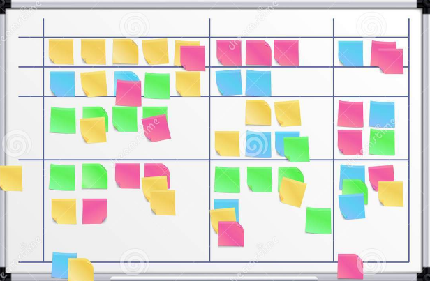

# Quick guide for GitHub and Markdown / Краткое руководство по GitHub и Markdown

## Оформление текста в Markdown

Пустая строка сверху и снизу текста создает абзац.

***Жирное,*** *курсивное,* и **полужирное** начертания - зависят от количества звездочек, начинающих и заканчивающих, выделяемый текст.
Вместо звездочек можно также использовать нижнее подчеркивание __для полужирного__ и _для курсива_, а главное - для *__полужирного курсива__*

## 6 уровней заголовков

Чем больше знаков #, тем меньше шрифт заголовка.

# Пример заголовка - 1 уровень
## Пример заголовка - 2 уровень
### Пример заголовка - 3 уровень
#### Пример заголовка - 4 уровень
##### Пример заголовка - 5 уровень
###### Пример заголовка - 6 уровень

## Работа с изображениями в Markdown

Чтобы вставить изображение в текст, достаточно написать следующее:
 

## Списки в Markdown

Чтобы добавить ненумерованные списки, необходимо пункты выделить звездочкой (*).
Например, вот так:
* элемент 1
* элемент 2
* элемент 3

Чтобы добавить нумерованные списки, необходимо пронумеровать пункты.
Например, так:
1. Первый блок
2. Второй блок

## Ссылки в Markdown

Есть три способа создать ссылку на какой-либо web-ресурс.
1. Поместить ссылку прямо в текст. Заключите текст, который пользователь должен видеть и который будет выглядеть как ссылка в квадратные скобки, а URL страницы в круглые так, чтобы комплекты скобок были написаны слитно. Также вы можете добавить дополнительное описание, заключив его в кавычки и поместив после URL.

Это [пример ссылки на сайт GitHab](http://github.com/ "веб-сервис для хостинга IT-проектов") помещенной в предложение.

Если описание определено, то оно отображается во всплывающей подсказке. Подведите курсор мыши к ссылке и через секунду подсказка появится.

2. Для длинных ссылок. Чтобы не загромождать текст, вы можете вставлять их подобно сноскам. Добавьте короткий идентификатор с помощью второй пары квадратных скобок (идентификатор может быть поясняющим словом, фразой или числом).

Это [пример ссылки на сайт GeekBrains][gb] помещенной в предложение.

Затем, в любом месте документа (предпочтительней сразу после абзаца или вместе с другими ссылками в конце документа) вы можете указать URL, связав его с идентификатором, например:

[gb]: http://gb.ru/ "IT образование"

 Это организационно более правильный способ создания документа, в будущем упрощающий его редактирование (особенно, если вы работаете не один).

3. Если вы хотите, чтобы ссылка представляла из себя сам URL, то просто поместите его в угловые скобки:

Посетите <http://gb.ru/> сейчас!

## Работа с таблицами в Markdown

Для построения таблиц необходимо использовать знаки (- и |) 

Столбцы могут быть выровнены по правому/левому краю или по центру с помощью двоеточий в строке отделяющей заголовок таблицы от остального текста

Дисциплина      | Баллы
----------------|:-----:
Введение в программирование (лекции)     |12
Введение в программирование (семинары)    |36

## Цитаты в Markdown

Чтобы указать, что часть текста является цитатой, нужно начать первую строку абзаца с угловой скобки >
Например:
> Пессимисты, глядя на стакан, который налит водой ровно наполовину, говорят, что он наполовину пуст. Оптимисты - что наполовину полон. А разработчики понимают, что просто сам стакан в два раза больше, чем должен быть.

> Боб Льюис. Писатель
## Заключение

# Настройка Git

git config --global user.name "NAME" *- к указанному имени NAME, будут в дальнейшем привязываться созданные вами коммиты*

git config --global user.email "EMAIL" *- указанный адрес EMAIL будет отображаться во всех коммитах*

git config --global color.ui auto *- цветовая подсветка текста в терминале*

git config --global core.editor "TEXT EDITOR" *- для использования собственного текстового редактора*

git config --list *- подробное описание конфигурации Git*

git version *- показывает используемую версию Git*

# Репозитороий. Создание и управление.

git init *– инициализация (создание) локального репозитория*

git status *– информация о текущем состоянии репозитория Git*

git add *– добавить файл или файлы к следующему коммиту*

git commit -m “message” *– создание коммита, с комментариями записанными в "massage"*

git log *– вывод на экран истории всех коммитов с их хеш-кодами*

git log --oneline *- сокращенный список коммитов*

git checkout *– переход от одного коммита к другому*

git checkout master *– вернуться к актуальному состоянию и продолжить работу*

git diff *– увидеть разницу между текущим файлом и закоммиченным файлом*

## Отмена изменений

git revert *- отменяет изменения, записанные только одним коммитом*

git reset [Коммит] *- откатывает проект к более раннему состоянию, удаляет все коммиты поданные после целевого*

git reset --hard [Коммит]

Команда git revert - более удобный и безопасный способ отмены изменений

## Коллективная работа в Git

git branch *- список именованных веток коммита, с указанием выбранной ветки*

git branch [имя новой ветки] *- создает новую ветку*

git branch -d [имя удаляемой ветки] *- удаляет выбранну ветку*

git switch -c *- переключается на выбранную ветку и обновляет рабочую директорию, до ее состояния*

git merge [имя ветки] *- вносит изменения указанной ветки в текущую ветку (слияние)*

git merge --abort *- отменяет попытку слияния*

> "Для себя я считаю git-merge зоной наибольшей ответственности, точкой огромной магической энергии и больших возможностей. Но это достаточно сложная команда, и даже достаточно длительный опыт работы с Git порой бывает недостаточным для освоение всех ее тонкостей и умения применить ее наиболее эффективно в какой-либо нестандартной ситуации." *-высказывание опытного пользователя Git*

## Удаленный репозиторий

Регистрация удалённого репозитория и обмен изменениями

$ git fetch [удалённый репозиторий] *- скачивает всю историю из удалённого репозитория*

$ git merge [удалённый репозиторий]/[ветка] *- вносит изменения из ветки удалённого репозитория в текущую ветку локального репозитория*

$ git push [удалённый репозиторий] [ветка] *- загружает все изменения локальной ветки в удалённый репозиторий*

$ git pull *- загружает историю из удалённого репозитория и объединяет её с локальной. pull = fetch + merge*

git clone [URL - address] *- скачивает репозиторий со всей его историей изменений*
 